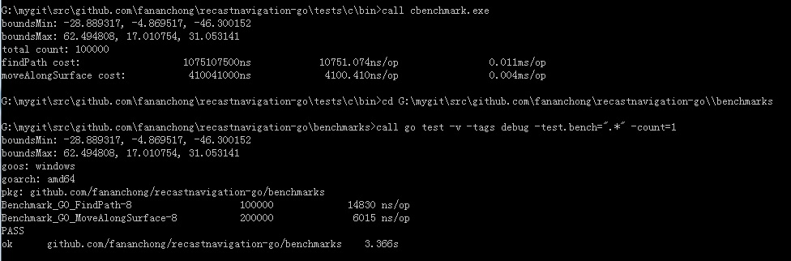

# recastnavigation-go
将recastnavigation翻译成golang语言版本

## 翻译内容

基于 recastnavigation git版本： 18562383f4c5cffa0678c709049340516ebc5e40

翻译：
  - Detour
  - DetourTileCache

## 基准测试

针对 c++原版 与 go翻译版本 的基准测试：

c++原版：[tests/c/benchmark.cpp](tests/c/benchmark.cpp)

go翻译版本: [benchmarks/go_test.go](benchmarks/go_test.go)

做测试前，先使用 gen_random_pos.bat 生成 随机路点信息
